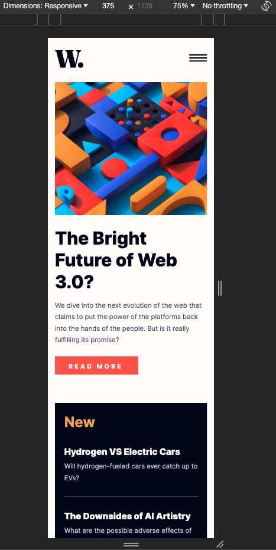
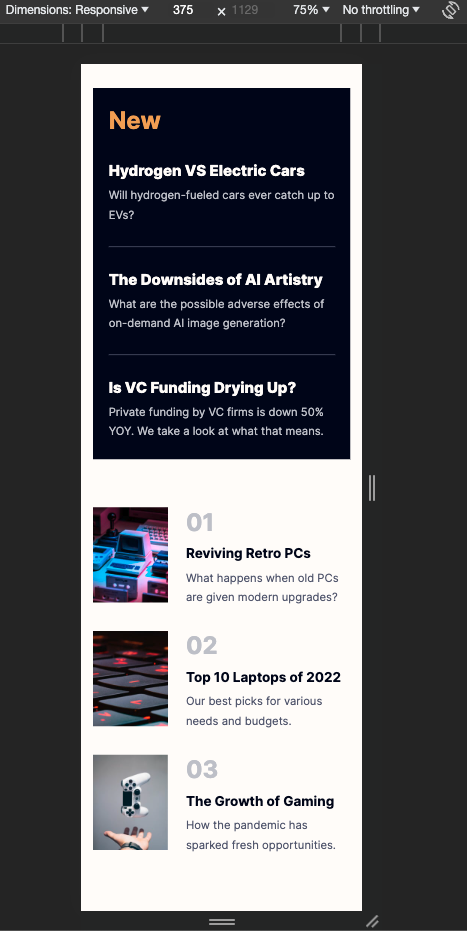

# Frontend Mentor - News homepage solution

This is a solution to the [News homepage challenge on Frontend Mentor](https://www.frontendmentor.io/challenges/news-homepage-H6SWTa1MFl). Frontend Mentor challenges help you improve your coding skills by building realistic projects.

## Table of contents

- [Overview](#overview)
  - [The challenge](#the-challenge)
  - [Screenshot](#screenshot)
  - [Links](#links)
- [My process](#my-process)
  - [Built with](#built-with)
  - [What I learned](#what-i-learned)
- [Author](#author)

## Overview

This project represents a web page for daily news. The web application is developed for desktop and mobile screen sizes.

### The challenge

Users should be able to:

- View the optimal layout for the interface depending on their device's screen size
- See hover and focus states for all interactive elements on the page

### Screenshot

#### Desktop version

#### Mobile version

### Links

- Solution URL: [Solution URL here](https://github.com/AlinaAlexandraVizireanu/news-homepage-main)
- Live Site URL: [Live site URL here](https://alinaalexandravizireanu.github.io/news-homepage-main/)

## My process

I started this project by checking the design on the Figma file, then I created the website's structure with HTML and then used CSS to implement the style. To create the layout I used Flexbox and Grid. The logic part of the application was built with JavaScript where I had to change the images path and create an event for the navigation.

### Built with

- Semantic HTML5 markup
- CSS custom properties
- Flexbox
- CSS Grid
- Mobile-first workflow

### What I learned

In the process of building the webpage I learned to combine Flexbox and CSS Grid to create the layout.

## Author

- Website - [Alina Alexandra VIZIREANU](https://github.com/AlinaAlexandraVizireanu/news-homepage-main)
- Frontend Mentor - [@AlinaAlexandraVizireanu](https://www.frontendmentor.io/profile/AlinaAlexandraVizireanu)
